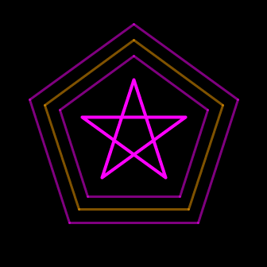
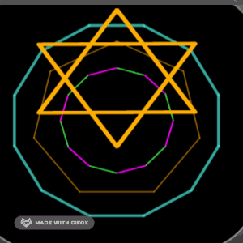

# geometrix
A totally useless playfile to create regular polygons in Fitbit OS\
trying to get an idea how to structure using interfaces/classes/types\
Aim was not to build on the existing Elements' prototypechain, bu create own types. 
## work in progress


   

It now can be used as widget in TS, having 2 types:

**Polygon** : a regular Polygon;

**Spyrogon**: here you can change the connection between the polygon points to create regular geometric shapes with 3 to 12 vertices.

(...got some more TODOs on it 😅)


___
## Creating a widget is just... 

 COPY:


* the folder `polygon-widget` into your app-folder
* the file `polygon.defs` into your resources-folder

\
ADD CODE:

### Resources/widgets.defs

\
Add `polygon.defs` import in your `widgets.defs`

```js

<svg>
    <defs>
        <link rel="stylesheet" href="styles.css" />
        <link rel="import" href="/mnt/sysassets/system_widget.defs" />
        <link rel="import" href="polygon.defs" />
    </defs>
</svg>


```

### Resources/index.view


\
Set a `<use>` in `index.view` like the following example

```js

<use id="anyId" href="#polygon-widget"  x="168" y="168" opacity = "1"/>

```
  
     
### App/index.ts

\
Import the widget in app/index.ts (Polygon and/or Spyrogon, depending on which you are going to use)

```js  

import { createPolygon, Polygon, Spyrogon } from './polygon-widget/polygon-widget';

```
\
And then instantiate your poly in `app/index.ts` like:
``` js

let anyName = createPolygon(0, document.getElementById('anyId')) as Polygon;

let anyOtherName = createPolygon(1, document.getElementById('anyOtherId')) as Spyrogon;

```
\
This will create shapes with the default values:
* radius = 100;
* points = 5;
* strokeWidth = 2;
* next = 1;

\
To choose custom values you can add these attributes like:


```js

let poly1 = createPolygon(0, document.getElementById('poly1'),120, 12, 10) as Polygon;

```

\
or for the Spyrogon like:
```js

let spyro1 = createPolygon(1, document.getElementById('spyro1'),150, 8, 4, 3) as Spyrogon;

```

\
The additional value here defines the next point ( so line0 goes from p0 to p3, line1 from p1 to p4...)

___
### Settings on `<use>`

\
(in index.view or styles.css)
* x
* y
* style (opacity, fill, display)

______
<h3>To see dynamic settings in TS...<h4>
<details><summary>...click me! </summary><blockquote>


* radius 
* points
* strokeWidth
* next
* rotate.angle
* x
* y

<details><summary>style </summary><blockquote>

* fill
* opacity
* display
 </blockquote></details>
 
<details><summary>scale </summary><blockquote>

* x
* y
</blockquote></details>


<details><summary>lines[index] </summary><blockquote>

* style 
    * fill
    * opacity
    * display
    * strokeWidth 
              

</blockquote></details>
</blockquote></details>

____


## Currently different to usual use:


* `strokeWidth` can be set directly on element!
Additionally for single lines
* `next` defines the +x point to wich to connect to.
* `lines` is an array of the lines, building the Polygon.

   So the settings of `style` on lines need to be done withe a el.lines.forEach for all or a group of lines.
   
   for a single line as el.lines[index]
   

___

(but YEAH!!!! ...running smooth on device with all the "dynamix" )




___
### ...and a huge THANKS!
to Gondwana from [Gondwanasoft](https://github.com/gondwanasoft) who helped me to understand OOP in JS a bit better, while working on the fitbit-3D-text project. This encouraged me to try something in TS (Not that I know, what I'm doing!).

He worked out a [fitbit-widget-template](https://github.com/gondwanasoft/fitbit-widget-template) for creating your own widgets based on an OOP approach in JS.

Any ideas or critcism would be highly appreciated! I just tried, what I thought might work. But I'm totally convinced there will be much better solutions...


