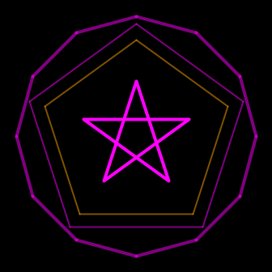

# geometrix
A totally useless playfile with regular polygons

It now can be used as widget in TS, having 2 types:

**Polygon** : a regular Polygon (mode 0);

**Spyrogon**: here you can change the connection between the polygon points to create regular geometric shapes with 3 to 12 vertices (mode 1).
got some more TODOs on it 😅

creating a widget is just setting a `<use>` in `index.view` 
and then instantiate your poly in `app/index.ts` like:

``` js
let poly2 = createPolygon(0, document.getElementById('poly2')) as Polygon;
let spyro = createPolygon(1, document.getElementById('spyro')) as Spyrogon;
```
___
## work in progress:
trying to get an idea how to structure using interfaces/classes/types   
   


### dynamically:
* 3 to 12 vertices,
* size of circle,
* number of points,
* connection between points (next point),
* fills perline/ fill-themes (1 to ... get applied per %points)
working now for a single object (class) now *somehow* .

As novice to this, I'd be happy for any ideas... so please feel invited 😁

...and running all (current) "dynamix"


